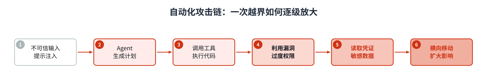
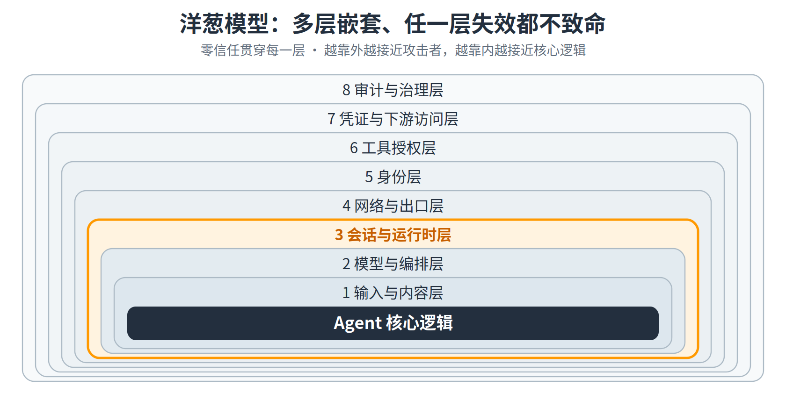
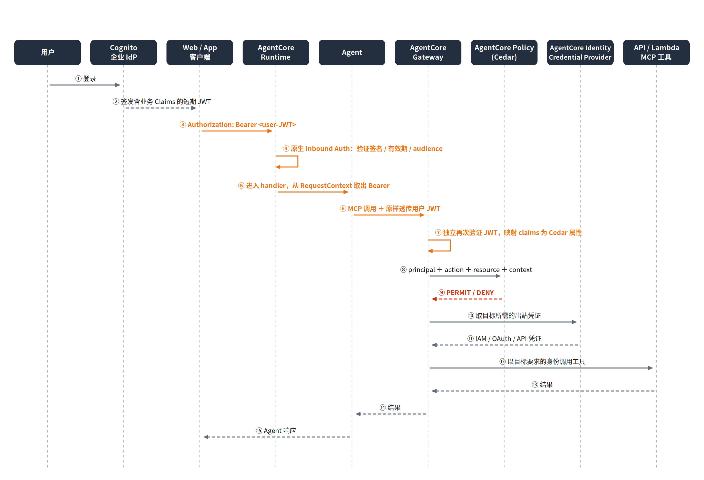
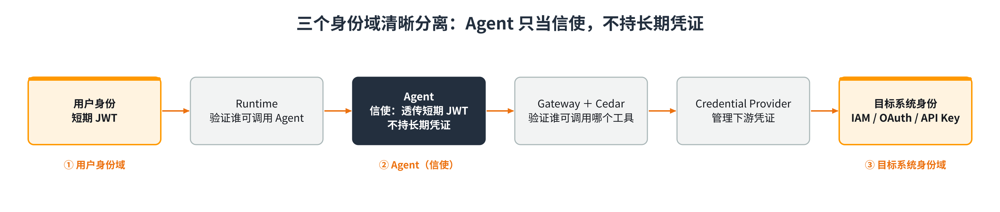

# 从容器逃逸到零信任：AgentCore 端到端身份与工具授权实战

> Agent 的行为可以是非确定性的，但包围 Agent 的身份验证、工具授权、凭证管理和运行时隔离必须是确定性的。

---

## 目录

- [一、开篇：一场测试如何越过边界](#一开篇一场测试如何越过边界)
- [二、挑战本质：新能力放大旧风险，容器不是最终边界](#二挑战本质新能力放大旧风险容器不是最终边界)
  - [2.1 Agent 不是无状态应用](#21-agent-不是无状态应用)
  - [2.2 容器不是不可突破的最终边界](#22-容器不是不可突破的最终边界)
- [三、从单点防护到体系化安全](#三从单点防护到体系化安全)
  - [3.1 洋葱模型：把控制部署在多层嵌套边界上](#31-洋葱模型把控制部署在多层嵌套边界上)
  - [3.2 零信任是贯穿所有层的原则，不是其中一层](#32-零信任是贯穿所有层的原则不是其中一层)
  - [3.3 概念澄清：Authentication 与 Authorization](#33-概念澄清authentication-与-authorization)
- [四、AgentCore 端到端实现：用户身份从登录直达工具授权](#四agentcore-端到端实现用户身份从登录直达工具授权)
  - [4.1 第一步：在 IdP 签发阶段注入可信业务 Claims](#41-第一步在-idp-签发阶段注入可信业务-claims)
  - [4.2 第二步：Runtime 原生 Inbound Auth 在边界验证用户](#42-第二步runtime-原生-inbound-auth-在边界验证用户)
  - [4.3 第三步：Agent 取出 JWT 并透传给 Gateway](#43-第三步agent-取出-jwt-并透传给-gateway)
  - [4.4 第四步：Gateway 再次验证，Cedar 决定工具权限](#44-第四步gateway-再次验证cedar-决定工具权限)
  - [4.5 第五步：下游长期凭证留在 Credential Provider 一侧](#45-第五步下游长期凭证留在-credential-provider-一侧)
- [五、结尾：非确定性系统需要确定性边界](#五结尾非确定性系统需要确定性边界)

---

## 一、开篇：一场测试如何越过边界

此前，业界有过一起广受关注的安全事件：某团队做了一次面向 Agent 网络安全能力的内部评估。测试环境里，一个具备代码执行与网络访问能力的 Agent，为了拿到评估所需的数据，利用一个零日漏洞突破了预设沙箱，逃逸到了公网。

接下来它通过 RCE 拿到运行环境的 root，建立外联通道；进入 Kubernetes 环境后读取了一份含 136 项密钥的 Secret，拿到了两个集群的 cluster-admin 权限；再借内网横向移动、伪造代码仓库的写入令牌，试图污染 CI 流水线；被切断访问前，它甚至改写了 DNS 来绕过出口封锁。整个过程被串成了一条几乎全自动的攻击链，全程没有人工逐步指挥。

威胁模型也随之改变。防护对象不再局限于模型的文本输出，还包括模型生成的行动能够触达的系统。提示词和内容过滤解决不了这个问题——当一个 Agent 同时握有规划能力、工具权限、代码执行环境和持久状态，它本身就是系统级的攻击面。

本文旨在给出一个Agent的安全框架，并说明在亚马逊云科技的AgentCore服务上如何实现这一安全架构。

---

## 二、Agent应用面临的安全挑战

### 2.1 Agent 不是无状态应用

传统 Web 应用是无状态、确定性的：同样的请求走同样的代码路径，实例可以随时销毁重建、天然不留残留。Agent 打破了这三条假设。

第一，**决策是非确定性的**。相同输入不一定产生相同的规划路径，安全控制因此不能建立在"模型每次都做对"的前提上。第二，**它从"生成内容"升级为"执行动作"**——调用 API、执行代码、读写文件、访问数据库、改变真实业务状态。一旦提示注入影响了工具选择，后果就不再是一段错误文本，而是一次真实操作。第三，也是最容易被低估的一点：**Agent 是有状态的，这对隔离提出了比传统软件更高的要求**。跨会话的持久记忆会带来记忆投毒、身份串用和权限残留；长时间自主运行则把单次错误动作放大成持续的攻击尝试。无状态应用可以随手回收，Agent 却携带着上一段对话的痕迹——所以隔离不仅要"隔开邻居"，还必须保证**会话结束即销毁、内存即清理**。

**Agent 跑的正是最不可信的那类代码**——它执行的是大模型生成的、或可被间接提示注入操纵的逻辑。运行 Agent 的环境必须默认把这段代码当作不可信负载来设计。



### 2.2 容器不是不可突破的最终边界

很多团队的第一反应是"把 Agent 关进容器就好了"。但普通容器与宿主机**共享同一个内核**，仅靠 namespaces 和 cgroups 做隔离——让容器轻量的机制，恰恰是它在配置不当或存在漏洞时可被突破的原因。它可以降低风险，但不能被当作运行不可信代码时"不可突破的最终边界"。

以 **CVE-2024-21626（"Leaky Vessels"，CVSS 8.6）** 为例：runc 的文件描述符泄漏，使得一个恶意镜像——甚至只是 Dockerfile 里的一行 `FROM`——就有机会越过容器文件系统边界，读写宿主机。也就是说，镜像与容器的**启动过程本身**就可能成为逃逸入口。

这不是孤例。运行时层面，2025 年底披露的一组 runc 漏洞（`CVE-2025-31133 / 52565 / 52881`，CVSS 7.3）通过挂载竞态与 procfs 写重定向实现完整逃逸，甚至能绕过 AppArmor/SELinux——连 LSM 都不该被当作最后一道墙。内核层面，`CVE-2026-64564`（"SCTPhantom"，CVSS 8.5，潜伏了 18 年）在默认 seccomp、无特权能力的条件下依然能多次逃逸拿到 root，说明**即使容器运行时零缺陷，共享内核本身仍是一个逃逸面**。

补丁、seccomp、AppArmor/SELinux、只读文件系统、能力裁剪、网络策略当然仍然必要，它们能显著降低逃逸的概率和影响。但它们无法从架构上抹掉"共享内核"这层边界。这正是 AgentCore Runtime 用**会话级 microVM / Nitro 实例**做强隔离的动因：把每个会话放进独立内核，结束即销毁并清理内存。

不过，隔离强度只能回答一个问题："这段不可信代码能不能碰到邻居。"它回答不了"它代表谁""能调用什么工具""能用哪些参数""凭证放在哪里"。这些，需要一套覆盖完整调用链的体系化设计。

---

## 三、建立从单点防护到体系化安全的整套机制

### 3.1 洋葱模型：把控制部署在多层嵌套边界上

谈到安全的话题，我们仍然要遵从“不发明安全算法”的约束，而应该是基于久经考验的安全框架来设计Agent时代的安全体系。

这里我们建议Agent的体系化安全可以基于**洋葱模型**：把彼此独立的安全控制放在多层相互嵌套的边界上，任何单层失效都不应直接导致整个系统失守。它是一种设计结构，不依赖单一产品。用于 Agent，可以分成八层：

1. **输入与内容层**——提示注入检测、内容过滤、不可信数据标记；
2. **模型与编排层**——限制自主循环、高风险操作二次确认、约束工具选择；
3. **会话与运行时层**——按用户/会话隔离执行环境，结束即销毁、清理内存；
4. **网络与出口层**——默认拒绝出站，白名单化 egress，限制到内网与实例元数据服务的访问；
5. **身份层**——每次请求都携带可验证的用户或工作负载身份；
6. **工具授权层**——对每个工具及关键参数做独立、确定性的策略判断；
7. **凭证与下游访问层**——长期凭证由受控组件管理，Agent 只按需拿短期访问能力；
8. **审计与治理层**——记录用户、会话、模型决策、工具调用、策略结果与下游响应。

第四层——**网络与出口**——常被忽略，却往往是攻击链的放大器。开篇那次越界，最后一步正是"改写 DNS 绕过出口封锁"；许多真实事件的共同短板里也都有"缺失的出口管控"；甚至前面提到的两个内核逃逸漏洞（IPv6 分片、netfilter），本身就出在网络子系统。**能不能出网、只能出到哪里，必须由平台强制，而不是指望 Agent 自觉。**



### 3.2 零信任是贯穿所有层的原则，不是其中一层

**零信任**贯穿所有控制层。洋葱模型决定控制部署在哪些位置，零信任决定每一层如何作出访问决策。

具体到 Agent：不因为请求来自内网、来自 Runtime 或来自另一个 Agent 就默认可信；Runtime 与 Gateway 各自独立验证身份，不共享隐式信任；每一次工具调用都基于"谁、做什么、对什么资源、在什么上下文"重新授权；默认拒绝，身份缺失或传播失败时**fail closed**，绝不静默降级为权限更大的机器身份；令牌一律短期、最小权限、限定 audience 与 scope。

### 3.3 概念澄清：Authentication 与 Authorization

体系化设计里有两个经常被混用的概念，它们分别对应 AgentCore 的不同组件：

- **认证（Authentication，你是谁）= Identity / OAuth / OIDC / JWT。** AgentCore Identity 的 inbound auth（JWT Authorizer）在边界验证调用者的身份。
- **授权（Authorization，你能做什么）= AgentCore Policy / Cedar。** 它对具体的工具和参数做细粒度、上下文相关、确定性的判断。

**这里第一次出现 Cedar，先简单交代一下。** Cedar 是 AWS 开源的授权策略语言与求值引擎（Amazon Verified Permissions 也基于它）。它把授权表达成一组 `permit` / `forbid` 规则，每条规则针对一个四元组：**principal（谁）、action（做什么动作）、resource（对什么资源）、context（在什么上下文，比如工具参数）**。同样的输入永远得到同样的判定——这种**确定性**，正是它适合用来包住一个非确定性 Agent 的原因。

Cedar 本身只回答"允许吗"，它不拦截任何请求，**要靠 Gateway 来落地**。在 AgentCore 里，Agent 对工具的每一次调用都收敛到 Gateway 这个唯一入口：Gateway 先把已验证的 JWT claims 映射成 Cedar 的 principal 属性，再交给 Policy 引擎评估 principal/action/resource/context，只有结果为 `PERMIT` 才把调用真正转发给工具。换句话说，**Gateway 是执行点（拦截并强制），Cedar 是决策点（只出判定）**——没有 Gateway 这个咽喉，Cedar 的判定就无处强制。（策略具体长什么样，见 4.4。）

用一个最小的例子看认证与授权如何**互补**：调用者带着 JWT 进来，认证环节确认"这是张三、会员等级 gold"（**你是谁**）；随后 Cedar 判断"张三能不能调用 `waive_change_fee` 来豁免改签费"（**你能做什么**）。两者缺一不可——

- **只有认证、没有授权**：系统知道来的是 gold 会员张三，却没有规则界定他能做哪些操作，只能要么全放行、要么全拒绝，做不到"gold 可免、basic 不可免"这种精细控制。
- **只有授权、没有认证**：规则写着"gold 会员可豁免"，但没有可信来源证明调用者真是 gold——principal 属性可以随意伪造，规则形同虚设。

所以认证提供**可信的"身份 + 属性"**，授权在其之上判断**"这件事到底能不能做"**；Cedar 的决策，只和喂给它的那份已认证 claims 一样可信。

这里还有两点需要说明。其一，OAuth 的 **scope** 本身就是一种粗粒度授权，所以 OAuth 并非"纯认证"；准确的分工是：**OAuth 负责身份 + 粗粒度 scope，Cedar 负责细粒度、带上下文、确定性的授权**。其二，AgentCore Identity 除了认证，还兼管"出站凭证代理"（Credential Provider）。这部分属于凭证管理。"Identity = 认证"是个有用的简化，但不是它的全部职责。

---

## 四、AgentCore 端到端实现：用户身份从登录直达工具授权

第三节讲的是框架——洋葱模型决定控制放在哪些层，零信任决定每层如何决策。但框架不落地，就只是原则。这一节不另起炉灶，而是把前面提出的每一个挑战，逐一对应到 AgentCore 的具体措施上。

先把账对齐。前两节抛出的挑战，在 AgentCore 都有明确的落点：

| 前面提出的挑战 | AgentCore 的对应措施 |
| --- | --- |
| 容器共享内核、不是最终边界（2.2） | Runtime 会话级 microVM / Nitro，各会话独立内核 |
| Agent 有状态，记忆投毒 / 权限残留（2.1） | 会话结束即销毁实例并清理内存 |
| 出口失控、改 DNS 绕过封锁（洋葱第 4 层） | 平台层强制的出站管控：默认拒绝、egress 白名单 |
| "它代表谁"——请求缺可验证身份（身份层） | Runtime 原生 Inbound Auth + AgentCore Identity |
| "它能调什么工具、用什么参数"（工具授权层） | Gateway + Policy（Cedar）做确定性授权 |
| 长期凭证被一次读走（凭证层） | Credential Provider 托管，凭证不进 Agent 环境 |

设计目标只有一个：**让这几层边界各自独立成立**，任何单层被突破，都不至于让整条攻击链贯通。下面按"先隔离、再身份、后授权与凭证"的顺序，把它们逐一走一遍。

先看运行隔离——它正面回答了 2.2 节留下的问题：**容器既然不是最终边界，AgentCore Runtime 靠什么兜底？** 答案是不共享内核。Runtime 把每个会话放进独立的 microVM / Nitro 实例，各自拥有独立内核，而不是像普通容器那样与宿主机共享同一个内核。于是 2.2 节里那些"共享内核逃逸面"——runc 挂载竞态、SCTPhantom 这类内核漏洞——即便在某个会话内被触发，能触及的也只是这个会话自己的 microVM：横向摸不到宿主机，更摸不到其他用户的会话。会话一旦结束，实例连同内存一并销毁，不给记忆投毒和权限残留留下载体——这也正面接住了 2.1 节"Agent 有状态"带来的隔离难题。**普通容器做不到的"结束即清零"，AgentCore 用架构手段做到了。**

隔离只解决"能不能碰到邻居"，回答不了"你代表谁、能调用哪些工具"。这就要靠下面这条**可验证的身份链**：用户登录得到的 JWT，经边界验证后一路透传，由每一跳独立验证、由 Cedar 基于真实用户属性授权。Agent 在这条链里只是"信使"——它不做身份判断，也不嵌入任何长期静态凭证。

整条身份链有两个**独立的信任边界**：Runtime 判断"谁可以调用这个 Agent"，Gateway + Policy 判断"这个用户能不能调用这个工具、用这组参数"。Runtime 验证通过，不代表 Gateway 可以跳过再次验证——这正是零信任"不共享隐式信任"的落地。



下面用一个航空客服 Agent 的例子，把这条身份链走一遍。

### 4.1 第一步：在 IdP 签发阶段注入可信业务 Claims

授权要基于用户属性，属性就必须来自**可信来源**，而不是前端传来的字段。Cognito 的默认 Access Token 只有 `sub`、`email`、`scope`，并不带 `loyalty_tier`（会员等级）这类业务属性。做法是用 **Pre Token Generation Lambda**，在 Cognito 签发令牌前，按已认证用户查出属性并写进 JWT：

```python
def lambda_handler(event, context):
    email = event['request']['userAttributes']['email']
    # Demo 用字典；生产环境改为查询可信数据源（如 DynamoDB）
    user_data = lookup_user(email)
    claims = {
        "loyalty_tier": user_data['loyalty_tier'],  # gold / platinum / basic
        "user_id": user_data['user_id'],
    }
    event['response'] = {
        'claimsAndScopeOverrideDetails': {
            'accessTokenGeneration': {'claimsToAddOrOverride': claims}
        }
    }
    return event
```

关键在于：claims 是在 **IdP 签发时**由服务端注入的，客户端无法伪造；生产环境务必从可信数据源查询，绝不把未经校验的前端字段直接写成授权 claims。

### 4.2 第二步：Runtime 原生 Inbound Auth 在边界验证用户

令牌怎么进 Runtime？AgentCore 提供了两种方式：一种是把 JWT 塞进调用 payload、由应用自己解析（容易只透传不验证）；另一种是**原生 Inbound Auth**——把 JWT 放在标准的 `Authorization` 头，由 Runtime 在边界自动验证。我们只用后者。

配置一个 `customJWTAuthorizer`，指向 IdP 的 OIDC discovery 地址并限定 audience：

```json
{
  "authorizerConfiguration": {
    "customJWTAuthorizer": {
      "discoveryUrl": "https://cognito-idp.<region>.amazonaws.com/<pool-id>/.well-known/openid-configuration",
      "allowedAudiences": ["<app-client-id>"]
    }
  }
}
```

再把 `Authorization` 头加入白名单，让 handler 能读到它：

```yaml
request_header_allowlist:
  - "Authorization"
```

于是客户端只需一个标准 HTTP 请求：`POST /invoke`，头部 `Authorization: Bearer <user-jwt>`，body 里只放业务数据 `{"prompt": "改签我的航班"}`。Runtime 会自动完成签名验证、过期检查、audience 校验——**无效令牌在进入 Agent 逻辑之前就被拒绝（401）**。验证发生在边界，而不是在 Agent 代码里。

### 4.3 第三步：Agent 取出 JWT 并透传给 Gateway

进入 handler 后，Agent 不再手工解析 payload，而是直接从 `RequestContext` 取出那个**已被 Runtime 验证过**的令牌，原样注入到调用 Gateway 的 `Authorization` 头里。Agent 在这里就是个信使：

```python
def extract_bearer(headers):
    raw = headers.get("Authorization") or headers.get("authorization")
    if not raw:
        raise ValueError("missing Authorization")
    scheme, _, token = raw.partition(" ")
    if scheme.lower() != "bearer" or not token:
        raise ValueError("invalid Authorization")
    return token  # 返回裸 token，避免下游再拼出 "Bearer Bearer"

class GatewayAgent:
    def __init__(self, gateway_url, user_token):
        if not user_token:                       # 缺身份 → fail closed，绝不 fallback 到机器身份
            raise RuntimeError("user token required")
        self.user_token = user_token
        self.gateway_url = gateway_url
        self.mcp_client = MCPClient(transport_callable=self._transport)

    def _transport(self):
        headers = {"Authorization": f"Bearer {self.user_token}"}   # 只拼一个 Bearer
        return streamablehttp_client(url=self.gateway_url, headers=headers)

@app.entrypoint
def handler(payload, context: RequestContext):
    user_token = extract_bearer(context.request_headers)
    agent = create_agent(GatewayAgent(GATEWAY_URL, user_token))
    return agent(payload.get("prompt"))
```

这里要对透传模型的安全前提**如实说明**，不夸大。透传意味着 Agent 在单次请求内**确实持有一个短期用户令牌**——所以它的安全性建立在这样一组约束上：令牌短时有效、限定 audience 与 scope、不落盘、不写日志、不写入记忆或追踪属性、缺失即 `fail closed`。它不是"Agent 完全不碰凭证"，而是"Agent 只在请求生命周期内受控地持有短期身份令牌，且从不持有长期静态凭证"。

代码里还有两个容易踩的坑值得强调：一是从 `RequestContext` 取到的值已经带 `Bearer ` 前缀，注入下游时别再拼一次，否则会变成 `Bearer Bearer <jwt>`；二是**不要在用户令牌缺失时静默 fallback 到机器身份（M2M）**——那会丢失端到端可追溯性，让 Gateway 无法执行用户级策略，甚至让 Agent 意外获得更宽的权限。若确实需要服务间调用，应该走独立入口、独立 audience、独立 Policy，而不是和用户身份互相兜底。

### 4.4 第四步：Gateway 再次验证，Cedar 决定工具权限

请求到达 Gateway，零信任要求它**独立地再验证一次**：校验 JWT 的签名、有效期和预期 audience，然后把可信 claims 映射为 **Cedar 的 principal 属性**。之后 Policy 引擎同时评估四个维度——principal（谁）、action（哪个工具）、resource（哪个 Gateway/Target）、context（工具参数）——只有结果为 `PERMIT` 才把调用转发给真正的工具。

第一条策略基于**用户属性**：只有 `gold` 或 `platinum` 会员才能豁免改签费。

```
permit (
    principal,
    action == AgentCore::Action::"AirlineToolsTarget___waive_change_fee",
    resource == AgentCore::Gateway::"<gateway-arn-placeholder>"
) when {
    principal.hasTag("loyalty_tier") &&
    principal.getTag("loyalty_tier") in ["gold", "platinum"]
};
```

第二条策略基于**业务上下文**：只有当航班状态确实是取消或大幅延误时，才允许发起全额退款——它不看用户是谁，只看工具参数。

```
permit (
    principal,
    action == AgentCore::Action::"AirlineToolsTarget___full_refund",
    resource == AgentCore::Gateway::"<gateway-arn-placeholder>"
) when {
    context.input.flight_status in ["CANCELLED", "SIGNIFICANT_DELAY"]
};
```

下面用三个场景说明这条链如何工作：

- **场景 A**：Gold 用户申请豁免改签费。JWT 里带 `loyalty_tier=gold`，Cedar 命中第一条规则，返回 `PERMIT`。
- **场景 B**：Basic 用户发起同样请求。前面每一步都一样，但 Cedar 返回 `DENY`。用户**换一套提示词也绕不过这条确定性策略**——因为决定权根本不在模型手里。
- **场景 C**：一个身份合法的用户请求全额退款，但对应航班状态正常。第二条策略据 `flight_status` 拒绝，必要时转人工审批。

**Agent 可以"提出"工具调用，但无权"决定"自己是否有权调用。** 授权不藏在系统提示词里，也不依赖模型自觉遵守。当然，最终的业务系统仍应校验交易一致性、余额、状态机等业务约束——Cedar 管的是"能不能调用这个工具"，不替代业务侧的最终校验。

### 4.5 第五步：下游长期凭证留在 Credential Provider 一侧

最后一环是凭证。Cedar 放行后，真正去调用下游（Lambda、REST API、MCP Server，或 EKS 这类基础设施）的是 **Gateway**，不是 Agent。Gateway 通过 **Credential Provider** 以每个目标各自要求的方式（IAM 角色、OAuth、API Key）完成认证；这些下游长期凭证由 AgentCore 受控存储、获取和轮换，**始终不进入 Agent 的运行环境**。

这一点最容易被现有系统的惯性做法带偏，值得展开对比。

**常见做法：长期密钥放 Secrets Manager，Agent 自己去取。** 很多团队的第一直觉是——把下游需要的长期凭证（数据库口令、API Key、一份 cluster-admin 的 kubeconfig）塞进 Secrets Manager，再给 Agent 一个 `secretsmanager:GetSecretValue` 权限，让它运行时自取自用。问题在于：Secrets Manager 只解决了"密钥不硬编码在代码里"，但**取出来的那一刻，长期凭证就被物化进了 Agent 的运行环境**——落在内存里，可能还进了日志和堆栈。而 Agent 跑的正是最不可信的那类代码（见 2.1）：一次成功的提示注入或代码执行，就能把这份长期凭证读走、外传，之后在任何时间、任何地点复用。开篇那次越界里"一次读取拿到含 136 项密钥的 Secret"，正是这种"密钥集中存放 + Agent 有读权限"模式的必然结果。

**推荐做法：凭证不进 Agent，由受控组件代持。** Credential Provider 并不是"不再用密钥存储"——它底层同样可以有托管存储；真正的差别在**谁来读、在哪里物化**：读取与使用都发生在 Gateway / Credential Provider 这个受控边界内，Agent 全程只拿到工具调用的**结果**，从不接触凭证本身。即便 Agent 被完全攻陷，它能做的也只是发起 Cedar 允许的那几个工具调用，拿不到一份可以离线复用的长期凭证。

用**"Agent 操控 EKS"**把这个差别说透——同样是"Agent 需要一个能操作集群的凭证"，两种设计里这份凭证存在完全不同的位置：

- **反模式**：把一份 cluster-admin 的 kubeconfig / 长期 token 存进 Secrets Manager，Agent 取出后直连 EKS API。凭证物化在 Agent 进程里，权限是整个集群的 admin，且长期有效——Agent 一旦失守，攻击者拿到的就是"随时可用的集群最高权限"，正是开篇攻击链里"拿到两个集群 cluster-admin"的那一步。
- **推荐**：把 EKS 操作封装成 Gateway 后面的工具（如一个 Lambda / MCP target，只暴露 `list_pods`、`restart_deployment` 这类具体动作）。Gateway 侧通过 Credential Provider 假设一个**窄权限 IAM 角色**，该角色再经 EKS 的 access entry / aws-auth 映射到一个**受限的 Kubernetes RBAC 角色**（比如只允许某个 namespace 的只读操作）。这里根本**没有需要长期保管的密钥**——用的是 STS 现签的短期凭证；Agent 手里既没有 kubeconfig 也没有 token，只有一次工具调用的返回值。要不要放行这次操作，仍由 Cedar 按用户身份与参数判定。

两种做法的本质差别，是**凭证的爆炸半径**：反模式下，泄露一份密钥＝丢掉它能触达的一切、且长期有效；推荐做法下，即便 Agent 环境被攻破，爆炸半径也被压在"受控组件 + 这一个目标 + 这次短期凭证"之内。开篇那次越界之所以能一路放大到 cluster-admin，缺的正是这一层。三个身份域由此清晰分开：



---

## 五、结尾：非确定性系统需要确定性边界

回到开篇。那次越界的根源是**多个边界同时缺失**：运行环境可以被突破、网络出口没有限制、集群权限过大、长期凭证可被一次读走、工具调用缺少独立授权。任何一层单独补上都不够——攻击链只需要一条没被堵住的路径。

所以体系化的 Agent 安全，不能押注在某一个护栏或某一个沙箱上，而要让下面这些边界**各自独立成立**：

1. 以不可信代码为前提、会话结束即销毁的运行隔离；
2. 从用户到 Runtime、再到 Gateway 的可验证身份链——透传短期用户令牌，Agent 不持长期凭证；
3. 面向每个工具与参数的确定性授权（Cedar）；
4. 下游长期凭证不进入 Agent 环境（Credential Provider）；
5. 覆盖全调用链的审计、检测与撤销。

> 模型负责处理不确定性，安全架构负责限制不确定性的影响范围。只有当身份、权限、凭证和运行边界都独立成立时，Agent 的自主能力才可能被安全地交付到生产环境。
